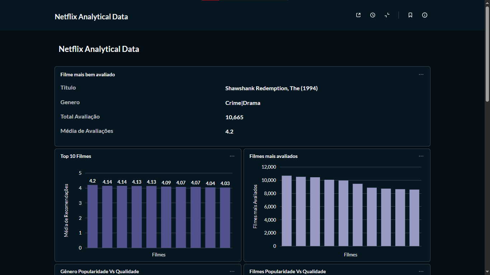
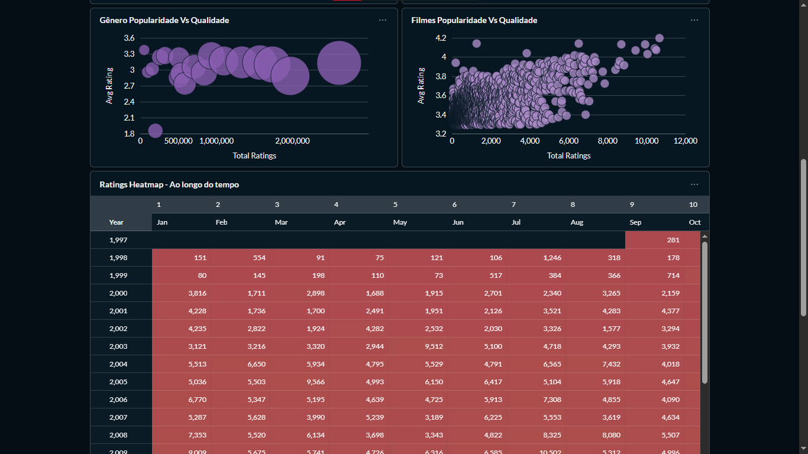
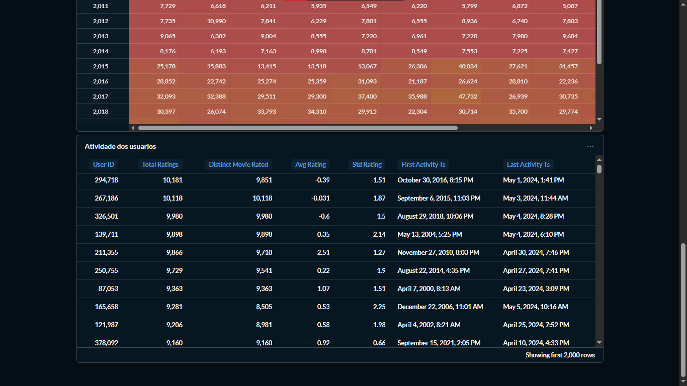
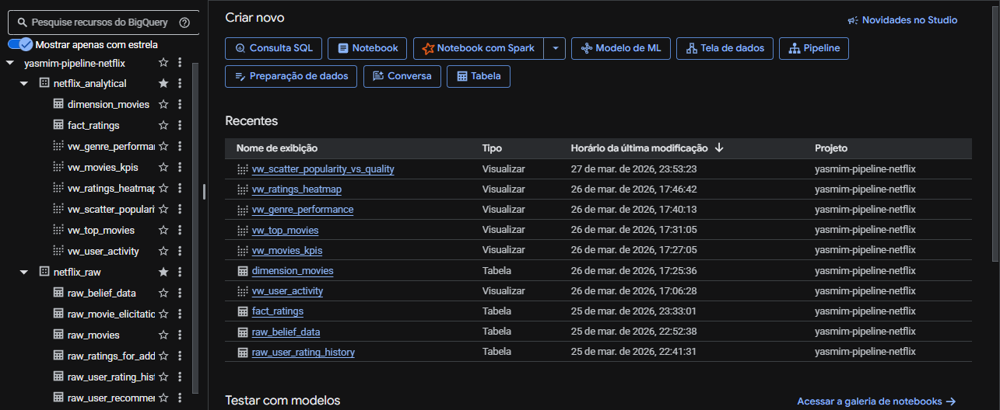
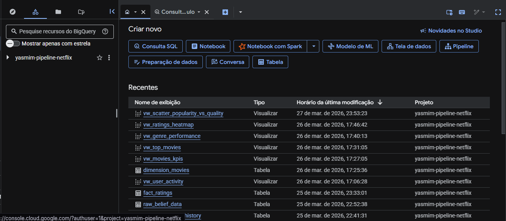
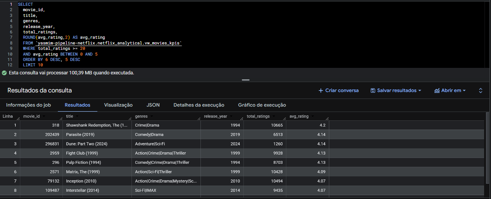

# 🎬 Netflix Data Pipeline (GCP)

Projeto de pipeline de dados desenvolvido utilizando Google Cloud Platform, com foco em ingestão, transformação e análise de dados de filmes.

---

## 🚀 Tecnologias utilizadas

- Google Cloud Platform (BigQuery, Cloud Storage)
- SQL
- Metabase
- Docker

---

## 🔄 Arquitetura do Pipeline

O projeto segue uma arquitetura moderna de dados:

1. Ingestão de dados via Cloud Storage (arquivos CSV)
2. Criação de tabelas externas no BigQuery (camada raw)
3. Transformação e limpeza dos dados
4. Modelagem dimensional (fact e dimension)
5. Criação de views analíticas
6. Visualização em dashboard (Metabase)

---

## 🧱 Modelagem de Dados

- `fact_ratings`: tabela fato contendo avaliações dos usuários
- `dimension_movies`: dimensão com informações dos filmes

---

## 📊 KPIs e Análises

- Top 10 filmes por avaliação
- Relação entre popularidade e qualidade
- Distribuição de avaliações por gênero
- Evolução das avaliações ao longo do tempo

---

## 📈 Insights

- Filmes mais populares nem sempre possuem as melhores avaliações
- Existe relação entre número de avaliações e média de notas
- A distribuição de avaliações varia ao longo do tempo

---

## 🖼️ Dashboard

## 🖼️ Dashboard

### 📊 Avaliações dos Filmes por Avaliação e Média de Avaliação

### 📈 Análise de Popularidade vs Avaliação para Filmes e Gêneros

### 🔥 Heatmap de Avaliações ao longo do Tempo

---

## ☁️ Estrutura no BigQuery

---

## 📦 Armazenamento (Cloud Storage)

---

## 💻 Query em execução

---

## 📌 Observações

Este projeto foi desenvolvido com fins educacionais, simulando um ambiente real de engenharia de dados em cloud.
